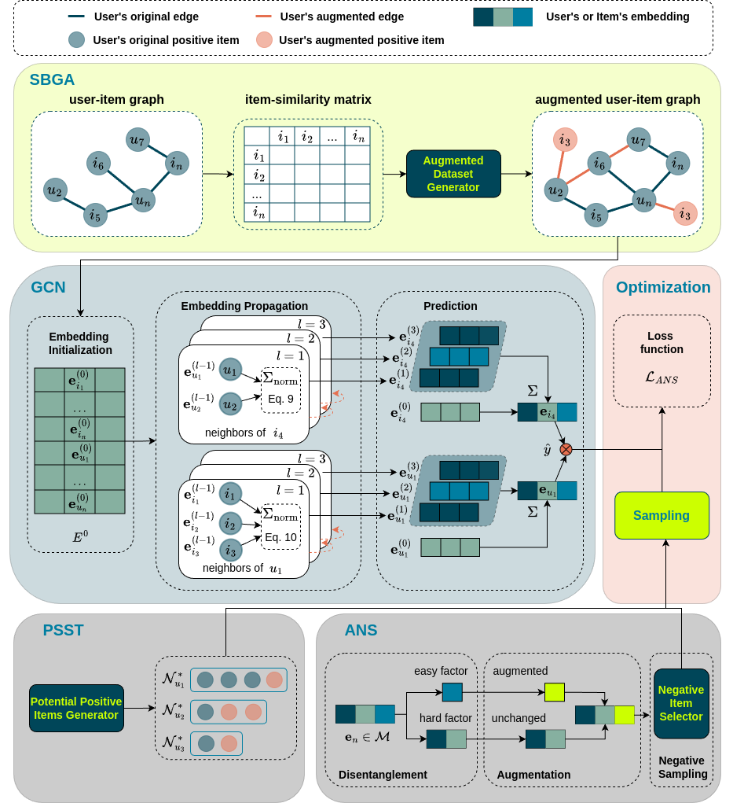

# GCN-AST: A Movie Recommendation System based on Graph Convolutional Networks and Augmented Self-Training

## Table of Contents

- [Introduction](#introduction)
- [Installation](#installation)
- [Usage](#usage)
- [Configuration](#configuration)
- [Model Architecture](#model-architecture)
- [License](#license)

## Introduction

This is the implementation of a master thesis project, which aims to build a movie recommendation system based on graph convolutional networks (GCN) and augmented self-training (AST). The project is implemented in Python using PyTorch. It is built on top of [RecBole](https://github.com/RUCAIBox/RecBole), which is a comprehensive and efficient library for recommendation algorithms. The following components are part of the recommender model:
- **SBGA**: A self-training algorithm that uses a graph-based approach to generate pseudo-labels for unlabeled data. Implemented in [`augmented_dataset.py`](recbole/data/dataset/augmented_dataset.py).
- **LightGCN** and **ANS**: A lightweight graph convolutional network model and Augmented Negative Sampling. Implemented in the same file [`ans.py`](recbole/model/general_recommender/ans.py)
- **PSST**: Positive Sampling for Self-Training. Implemented in [`positive_sampler.py`](recbole/sampler/positive_sampler.py).


## Installation

### Requirements

GCN-AST requires Python version 3.7 or later.

### Install from GitHub

1. Clone the repository:

    ```bash
    git clone https://github.com/heupelS/GCN-AST.git
    cd GCN-AST
    ```

2. Install the required dependencies:

    ```bash
    pip install -r requirements.txt
    ```

### Install from Source (ZIP Folder)

1. Download the source code from the [GCN-AST - GitHub repository](https://github.com/heupelS/GCN-AST.git) as a ZIP file.

2. Extract the ZIP file:

    ```bash
    unzip GCN-AST-main.zip
    cd GCN-AST-main
    ```

3. Install the required dependencies:

    ```bash
    pip install -r requirements.txt
    ```
    or use this command if you plan to make changes to the code and want those changes to be immediately reflected without reinstalling:

    ```bash
    pip install -e . --verbose
    ```

After installation, you can proceed to use the GCN-AST model as described in the [Usage](#usage) section.

## Usage

To use the GCN-AST model, you can use the provided script:
    
```bash
python run_recbole.py --config_files=./recbole/properties/GCN-AST.yaml
```

This will run the GCN-AST model with the specified configuration file `GCN-AST.yaml`. The configuration file contains the hyperparameters and settings for the framework. This will train the model on the specified dataset and evaluate the model performance.
An example output of the model training and evaluation is shown below:

```
17 Jul 14:49    INFO  ['run_recbole.py', '--config_files=./recbole/properties/GCN-AST.yaml']
17 Jul 14:49    INFO  
General Hyper Parameters:
gpu_id = 0
use_gpu = True
seed = 2020
state = INFO
reproducibility = True
data_path = /home/simeon/Git_Repositories/GCN-AST/recbole/config/../dataset_example/ml-100k
checkpoint_dir = saved
show_progress = True
save_dataset = False
dataset_save_path = None
save_dataloaders = False
dataloaders_save_path = None
log_wandb = False

Training Hyper Parameters:
epochs = 500
train_batch_size = 4096
learner = adam
learning_rate = 0.0001
train_neg_sample_args = {'distribution': 'uniform', 'sample_num': 5, 'alpha': 1.0, 'dynamic': False, 'candidate_num': 0}
eval_step = 1
stopping_step = 10
clip_grad_norm = None
weight_decay = 0.0
loss_decimal_place = 4

Evaluation Hyper Parameters:
eval_args = {'split': {'RS': [0.8, 0.1, 0.1]}, 'group_by': 'user', 'order': 'RO', 'mode': 'full'}
repeatable = False
metrics = ['Recall', 'NDCG', 'MRR', 'Hit', 'Precision']
topk = [10, 20]
valid_metric = Recall@20
valid_metric_bigger = True
eval_batch_size = 4096
metric_decimal_place = 3

Dataset Hyper Parameters:
field_separator = 
seq_separator =  
USER_ID_FIELD = user_id
ITEM_ID_FIELD = item_id
RATING_FIELD = rating
TIME_FIELD = timestamp
seq_len = None
LABEL_FIELD = label
threshold = None
NEG_PREFIX = neg_
load_col = {'inter': ['user_id', 'item_id']}
unload_col = None
unused_col = None
additional_feat_suffix = None
rm_dup_inter = None
val_interval = None
filter_inter_by_user_or_item = True
user_inter_num_interval = None
item_inter_num_interval = None
alias_of_user_id = None
alias_of_item_id = None
alias_of_entity_id = None
alias_of_relation_id = None
preload_weight = None
normalize_field = None
normalize_all = True
ITEM_LIST_LENGTH_FIELD = item_length
LIST_SUFFIX = _list
MAX_ITEM_LIST_LENGTH = 50
POSITION_FIELD = position_id
HEAD_ENTITY_ID_FIELD = head_id
TAIL_ENTITY_ID_FIELD = tail_id
RELATION_ID_FIELD = relation_id
ENTITY_ID_FIELD = entity_id
kg_reverse_r = False
entity_kg_num_interval = None
relation_kg_num_interval = None
benchmark_filename = None

Other Hyper Parameters: 
worker = 0
wandb_project = recbole
shuffle = True
plot_learning_curve = False
model_name_custom = -
require_pow = False
enable_amp = False
enable_scaler = True
transform = None
positive_sampling = True
numerical_features = []
discretization = None
MODEL_TYPE = ModelType.GENERAL
embedding_size = 64
n_layers = 2
reg_weight = 0.001
eps = 0.3579063307361654
gamma = 0.03
enable_PSST = True
Q = 8
enable_SBGA = False
K = 3
P = 20
MODEL_INPUT_TYPE = InputType.PAIRWISE
eval_type = EvaluatorType.RANKING
single_spec = True
local_rank = 0
device = cuda
eval_neg_sample_args = {'distribution': 'uniform', 'sample_num': 'none'}


17 Jul 14:49    INFO  ml-100k
The number of users: 944
Average actions of users: 106.04453870625663
The number of items: 1683
Average actions of items: 59.45303210463734
The number of inters: 100000
The sparsity of the dataset: 93.70575143257098%
Remain Fields: ['user_id', 'item_id']
17 Jul 14:49    INFO  [Training]: train_batch_size = [4096] train_neg_sample_args: [{'distribution': 'uniform', 'sample_num': 5, 'alpha': 1.0, 'dynamic': False, 'candidate_num': 0}]
17 Jul 14:49    INFO  [Evaluation]: eval_batch_size = [4096] eval_args: [{'split': {'RS': [0.8, 0.1, 0.1]}, 'group_by': 'user', 'order': 'RO', 'mode': 'full'}]
/home/simeon/Git_Repositories/GCN-AST/recbole/model/general_recommender/ans.py:110: UserWarning: torch.sparse.SparseTensor(indices, values, shape, *, device=) is deprecated.  Please use torch.sparse_coo_tensor(indices, values, shape, dtype=, device=). (Triggered internally at ../torch/csrc/utils/tensor_new.cpp:623.)
  SparseL = torch.sparse.FloatTensor(i, data, torch.Size(L.shape))
17 Jul 14:49    INFO  ANS(
  (user_embedding): Embedding(944, 64)
  (item_embedding): Embedding(1683, 64)
  (mf_loss): BPRLoss()
  (reg_loss): EmbLoss()
  (user_gate): Linear(in_features=64, out_features=64, bias=True)
  (item_gate): Linear(in_features=64, out_features=64, bias=True)
  (pos_gate): Linear(in_features=64, out_features=64, bias=True)
  (neg_gate): Linear(in_features=64, out_features=64, bias=True)
  (hard_gate): Linear(in_features=64, out_features=64, bias=True)
  (conf_gate): Linear(in_features=64, out_features=64, bias=True)
  (easy_gate): Linear(in_features=64, out_features=64, bias=True)
  (margin_model): Linear(in_features=64, out_features=1, bias=True)
)
Trainable parameters: 197313
17 Jul 14:49    INFO  FLOPs: 0.0
Train     0: 100%|█████████████████████████| 99/99 [00:02<00:00, 33.12it/s, GPU RAM: 0.09 G/15.98 G]
17 Jul 14:49    INFO  epoch 0 training [time: 2.99s, train loss: 74.7694]
Evaluate   : 100%|█████████████████████| 472/472 [00:00<00:00, 1074.11it/s, GPU RAM: 0.09 G/15.98 G]
17 Jul 14:49    INFO  epoch 0 evaluating [time: 0.44s, valid_score: 0.013000]
17 Jul 14:49    INFO  valid result: 
recall@10 : 0.007    recall@20 : 0.013    ndcg@10 : 0.009    ndcg@20 : 0.011    mrr@10 : 0.024    mrr@20 : 0.028    hit@10 : 0.071    hit@20 : 0.126    precision@10 : 0.007    precision@20 : 0.007
17 Jul 14:49    INFO  Saving current: saved/ANS-Jul-17-2024_14-49-12.pth
...
Train   430: 100%|███████████████████████| 108/108 [00:01<00:00, 59.76it/s, GPU RAM: 0.09 G/15.98 G]
17 Jul 15:06    INFO  epoch 430 training [time: 1.81s, train loss: 33.0123]
Evaluate   : 100%|█████████████████████| 472/472 [00:00<00:00, 1164.12it/s, GPU RAM: 0.09 G/15.98 G]
17 Jul 15:06    INFO  epoch 430 evaluating [time: 0.41s, valid_score: 0.340000]
17 Jul 15:06    INFO  valid result: 
recall@10 : 0.232    recall@20 : 0.34    ndcg@10 : 0.255    ndcg@20 : 0.275    mrr@10 : 0.425    mrr@20 : 0.433    hit@10 : 0.779    hit@20 : 0.883    precision@10 : 0.174    precision@20 : 0.13
17 Jul 15:06    INFO  Finished training, best eval result in epoch 219
17 Jul 15:06    INFO  Average training time per epoch: 1.92 seconds
17 Jul 15:06    INFO  Epochs to converge: 431
17 Jul 15:06    INFO  Loading model structure and parameters from saved/ANS-Jul-17-2024_14-49-12.pth
17 Jul 15:06    INFO  The running environment of this training is as follows:
+-------------+----------------+
| Environment |     Usage      |
+=============+================+
| CPU         |     2.00 %     |
+-------------+----------------+
| GPU         | 0.09 G/15.98 G |
+-------------+----------------+
| Memory      | 1.41 G/15.47 G |
+-------------+----------------+
17 Jul 15:06    INFO  best valid : OrderedDict([('recall@10', 0.235), ('recall@20', 0.358), ('ndcg@10', 0.257), ('ndcg@20', 0.286), ('mrr@10', 0.425), ('mrr@20', 0.433), ('hit@10', 0.785), ('hit@20', 0.895), ('precision@10', 0.177), ('precision@20', 0.139)])
17 Jul 15:06    INFO  test result: OrderedDict([('recall@10', 0.272), ('recall@20', 0.398), ('ndcg@10', 0.327), ('ndcg@20', 0.344), ('mrr@10', 0.525), ('mrr@20', 0.53), ('hit@10', 0.825), ('hit@20', 0.909), ('precision@10', 0.221), ('precision@20', 0.165)])
```

The output shows the training and evaluation process of the GCN-AST model. The training loss, evaluation metrics, and model parameters are displayed in the output. The model is saved in the `saved` directory after training.

## Configuration

### Model-specific Hyperparameter Config (GCN-AST)
The configuration of the GCN-AST model is defined in the [`GCN-AST.yaml`](recbole/properties/GCN-AST.yaml) file. The configuration file contains the hyperparameters for the model.

### General Hyperparameter Config
The general hyperparameters for the training process are defined in the [`overall.yaml`](recbole/properties/overall.yaml) file. These hyperparameters include the training epochs, batch size, learning rate, and evaluation settings. They are grouped into three categories: Environment, Training, and Evaluation settings.

## Model Architecture

The detailed model architecture is described in the image below:



## License

This project is licensed under the MIT License - see the [LICENSE](LICENSE) file for details.